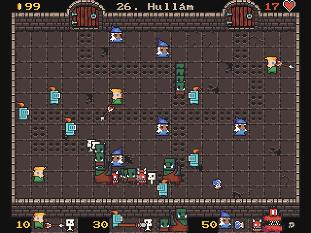

# PinceTD
A tower defence game in C with SDL2 as a university homework assignment.

Programom egy toronyvédő (Tower Defence) típusú játék, a játékos által lerakott tornyoknak kell lelőni az ellenségeket, mielőtt azok célba jutnak. A tornyok lövés előtt kiszámolják, hogy mennyi időbe telik, amíg a lövedék eljut az ellenségig, és annyi idő múlva hol lesz az ellenség, milyen szögben kell rá célozni. A különböző fajta ellenségeket viszont csak bizonyos tornyok tudják lelőni!

Fordított verzió Linuxra és Windowsra letölthető a [kiadásoknál](https://github.com/4321ba/PinceTD/releases).

Specifikáció és dokumentációk: [itt](dokumentacio/dokumentacio.md).
